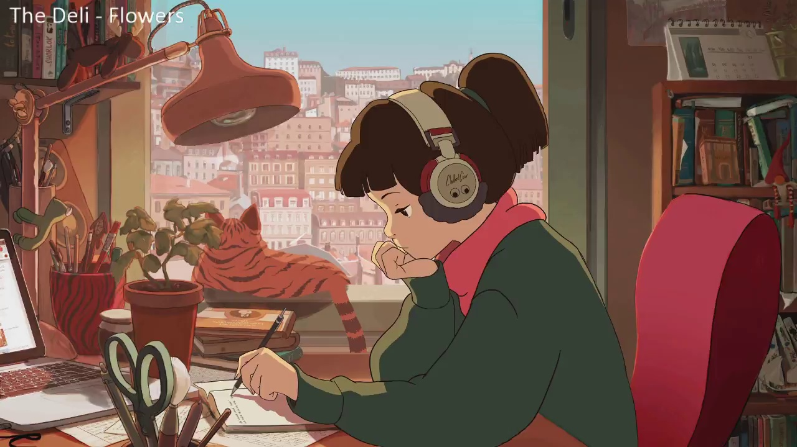
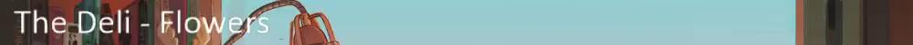

# chilledcow-scrobbler
LastFM scrobbler for chilledcow youtube stream

## Requirements
- Tesseract-OCR

## Python Requirements
- opencv
- pafy
- youtube-dl
- numpy
- pillow image
- pytesseract
- pylast

## Usage

```
python ccs.py credentials_file_json chilledcow_youtube_video_link
```
## Credentials File
- You need a LastFM API. You can apply from [here](https://www.last.fm/api/account/create).
- Credentials file must be JSON in this format;
```
{
 "LASTFM_API_KEY" : "sample",
 "LASTFM_SHARED_SECRET" : "sample",
 "username" : "sample",
 "password_hash" : "sample" 
}
```
- You can generate your password_hash by
```
pylast.md5(password)
```


## How does it work
- It works in the background and scrobbles every song written in the stream until you kill the script.
- Grabs the youtube link and extracts the stream url.
- OpenCV opens the stream and captures one single frame every 30 seconds

- Image gets cropped

- Remove the background

- OCR on image
- Send to Last.FM (if it didn't send it already)

